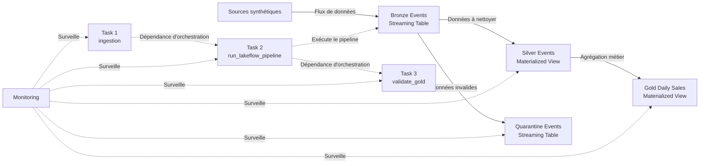

# S06 J2 — Lakeflow, orchestration et monitoring

**Date :** dimanche 13 septembre 2026  
**Semaine :** 6  
**Phase :** Phase 0  
**Focus :** Databricks Data Engineer Associate  
**Durée prévue :** 120 minutes

---

## Objectif de la séance

Expliquer comment **Lakeflow Jobs** orchestre des traitements déclaratifs, distinguer les **Materialized Views** des **Streaming Tables**, puis construire une stratégie simple de monitoring et de diagnostic.

Cette séance consolide le lab pratique réalisé précédemment avec :

- Lakeflow Jobs ;
- Spark Declarative Pipelines ;
- Bronze / Silver / Gold ;
- Materialized Views ;
- Streaming Tables ;
- Expectations ;
- Quarantine ;
- monitoring ;
- orchestration.

---

# 1. Questions de démarrage

Avant consultation de la documentation, trois questions structurent la séance :

1. **Que déclare un pipeline ?**
2. **Que contrôle un Job ?**
3. **Quels signaux indiquent un échec ou un problème de fonctionnement ?**

Les réponses sont consolidées à la fin de cette note.

---

# 2. Vue d’ensemble de l’architecture

## Schéma



---

## Lecture du schéma

Deux types de relations doivent être distingués.

### Flux de données

Les flèches pleines représentent la circulation des données :

```text
source
   ↓
bronze
   ↓
silver
   ↓
gold
```

Une seconde branche part de Bronze :

```text
bronze
   ↓
quarantine
```

La quarantaine conserve les données invalides qui ne doivent pas continuer vers les couches analytiques.

### Flux de contrôle

Les flèches pointillées représentent l’orchestration :

```text
ingestion
    ↓
run_lakeflow_pipeline
    ↓
validate_gold
```

Cette orchestration est gérée par **Lakeflow Jobs**.

---

# 3. Lakeflow Jobs vs Spark Declarative Pipelines

| Composant | Responsabilité principale | Question à laquelle il répond |
|---|---|---|
| Lakeflow Jobs | Orchestrer les tâches et leur exécution | Dans quel ordre et dans quelles conditions les traitements doivent-ils être exécutés ? |
| Spark Declarative Pipelines | Déclarer les datasets, transformations et dépendances de données | Quels résultats de données doivent être produits et à partir de quelles données ? |

---

## Lakeflow Jobs

Lakeflow Jobs gère notamment :

- les tâches ;
- les dépendances ;
- les paramètres ;
- les déclencheurs ;
- les retries ;
- les états d’exécution ;
- la concurrence ;
- la queue ;
- les notifications ;
- certains seuils de monitoring.

Exemple :

```text
ingestion
    ↓
pipeline
    ↓
validation
```

---

## Spark Declarative Pipelines

Spark Declarative Pipelines décrit les transformations.

Exemple :

```text
bronze_events
      ↓
silver_events
      ↓
gold_daily_sales
```

Le pipeline comprend les dépendances à partir des datasets utilisés.

Il n’est donc pas nécessaire d’écrire une orchestration procédurale comme :

```text
run_bronze()
run_silver()
run_gold()
```

On décrit plutôt :

```text
silver dépend de bronze
gold dépend de silver
```

Le moteur construit alors le graphe de dépendances.

---

# 4. Lakeflow Jobs — éléments d’orchestration

| Élément | Rôle | Exemple synthétique | Panne possible | Reprise |
|---|---|---|---|---|
| Task | Unité de travail exécutée dans un Job | `ingestion`, `run_lakeflow_pipeline`, `validate_gold` | Code en erreur | Corriger puis relancer la tâche ou le Job |
| Dependency | Contrôler l’ordre d’exécution | `ingestion → pipeline → validation` | Une tâche upstream échoue | La tâche downstream attend ou devient `UPSTREAM FAILED` |
| Parameter | Fournir une valeur au runtime | `processing_date=2026-09-13` | Paramètre manquant ou incorrect | Corriger la valeur puis relancer sans modifier le code |
| Trigger | Définir quand le Job démarre | Tous les jours à 06:00 | Trigger mal configuré | Corriger la configuration ou exécuter manuellement |
| Retry | Retenter automatiquement une tâche | Deux nouvelles tentatives | Erreur temporaire de compute | Nouvelle tentative automatique |
| Run state | Représenter l’état d’une exécution | `RUNNING`, `SUCCESS`, `FAILED` | Exécution bloquée ou échouée | Identifier la première erreur réelle |
| Queue | Mettre un run en attente si aucune place n’est disponible | Deuxième run en attente | Trop d’exécutions demandées | Le run démarre lorsqu’une place se libère |
| Concurrent runs | Limiter le nombre de runs simultanés | Maximum = 1 | Deux runs tentent de traiter les mêmes données | Garder un seul run simultané ou maîtriser le parallélisme |

---

# 5. Dépendances et états d’exécution

Workflow du lab :

```text
ingestion
    ↓
run_lakeflow_pipeline
    ↓
validate_gold
```

Si `run_lakeflow_pipeline` échoue :

```text
ingestion              SUCCESS
run_lakeflow_pipeline  FAILED
validate_gold           UPSTREAM FAILED
```

La distinction est importante.

## FAILED

La tâche elle-même a été exécutée et a échoué.

## UPSTREAM FAILED

La tâche n’a pas pu être exécutée normalement car une dépendance précédente a échoué.

---

# 6. Retries

Un retry permet de relancer automatiquement une tâche après un échec.

Exemple :

```text
transformation
    ↓
FAILED
    ↓
retry
    ↓
SUCCESS
    ↓
validation peut démarrer
```

Un premier échec ne signifie donc pas nécessairement que l’état final du Job sera `FAILED`.

---

# 7. Parameters

Un paramètre permet de séparer une valeur variable de la logique du code.

Exemple :

```text
processing_date = 2026-09-13
```

Le même code peut être relancé avec :

```text
processing_date = 2026-09-12
```

sans modifier le notebook.

Cela facilite notamment :

- les reruns ;
- les reprocessings ;
- la réutilisation du code ;
- la séparation configuration / logique.

Les secrets ne doivent toutefois pas être placés simplement en clair dans des paramètres.

---

# 8. Triggers

Un trigger répond à la question :

> Quand faut-il lancer le Job ?

| Type de déclenchement | Exemple |
|---|---|
| Manual | L’utilisateur clique sur `Run now` |
| Scheduled | Tous les jours à 06:00 |
| File arrival | Lorsqu’un nouveau fichier arrive |
| Table update | Lorsqu’une table source est actualisée |
| Continuous | Le traitement fonctionne de manière continue |

---

## Exemple du lab

Le Job a principalement été lancé manuellement :

```text
Run now
   ↓
ingestion
   ↓
pipeline
   ↓
validation
```

Pour un traitement quotidien :

```text
Scheduled trigger
      ↓
06:00
      ↓
ingestion
      ↓
pipeline
      ↓
validation
```

Il faut éviter de déclencher un Job sur une table qu’il produit lui-même, afin de ne pas créer un cycle d’exécution.

---

# 9. Queue et Maximum Concurrent Runs

Configuration étudiée :

```text
Maximum concurrent runs = 1
Queue = ON
```

Exemple :

```text
06:00 → Run A démarre

06:05 → Run B est demandé
         ↓
       QUEUED

06:10 → Run A se termine
         ↓
       Run B peut démarrer
```

Le deuxième run attend que le premier **se termine**.

Il n’attend pas nécessairement que le premier réussisse.

La première exécution peut terminer en :

```text
SUCCESS
FAILED
CANCELED
```

Une fois la place libérée, le run en queue peut démarrer.

---

# 10. Streaming Table

## Définition

Une Streaming Table est adaptée au traitement incrémental de données qui arrivent progressivement.

Exemple du lab :

```text
s06_synthetic_events_source
             ↓
        readStream
             ↓
       bronze_events
```

Code conceptuel :

```python
@dp.table(
    name="bronze_events"
)
def bronze_events():
    return spark.readStream.table(
        "s06_synthetic_events_source"
    )
```

---

## Données historiques

Lors du démarrage initial, le traitement peut prendre en compte les données déjà disponibles dans la source.

Exemple :

```text
event 1
event 2
event 3
```

---

## Nouvelles entrées

De nouveaux événements peuvent ensuite arriver :

```text
event 4
event 5
event 6
```

La logique streaming permet de progresser sur ces nouvelles données au lieu de raisonner systématiquement comme un recalcul complet.

---

## Progression

Le moteur de streaming suit la progression du traitement.

La notion importante est :

```text
données déjà traitées
+
nouvelles données
```

plutôt que :

```text
relire intégralement toute la source à chaque fois
```

---

## Cas d’usage

Une Streaming Table est particulièrement naturelle pour :

- l’ingestion ;
- une couche Bronze ;
- des événements ;
- des fichiers arrivant régulièrement ;
- des flux incrémentaux.

---

## Avantages

- traitement incrémental ;
- bonne adaptation aux événements ;
- réduction du retraitement inutile ;
- intégration naturelle avec des sources progressives.

---

## Limites

- gestion de l’état du streaming ;
- nécessité de suivre la progression ;
- certaines transformations sont plus simples avec des traitements batch ;
- nécessité d’une stratégie claire pour les erreurs de données.

---

# 11. Materialized View

## Définition

Une Materialized View représente le résultat calculé et maintenu d’une requête déclarative.

Exemple :

```text
silver_events
      ↓
GROUP BY date, category
      ↓
gold_daily_sales
```

---

## Exemple du lab

La table Gold contient :

```text
event_date
category
total_amount
event_count
```

Exemple de logique :

```python
spark.read.table("silver_events") \
    .groupBy("event_date", "category") \
    .agg(
        sum("amount"),
        count("*")
    )
```

Le résultat attendu peut être :

| event_date | category | total_amount | event_count |
|---|---:|---:|---:|
| 2026-09-12 | PC | 900 | 1 |
| 2026-09-12 | Phone | 700 | 1 |
| 2026-09-13 | PC | 1200 | 1 |

---

## Production de la vue

Le pipeline effectue un refresh.

Le moteur analyse ensuite :

- la requête ;
- les dépendances ;
- les données disponibles ;
- les transformations nécessaires.

Le développeur décrit essentiellement **le résultat souhaité**.

---

## Cas d’usage

Les Materialized Views sont naturelles pour :

- les agrégations ;
- les résultats analytiques ;
- certaines jointures ;
- les tables métier ;
- une couche Gold.

---

## Avantages

- résultats pré-calculés ;
- logique déclarative ;
- consommation analytique facilitée ;
- dépendances visibles dans le graphe ;
- bonne adaptation aux agrégations métier.

---

## Limites

- pas toujours le meilleur choix pour un besoin de très faible latence ;
- certaines transformations peuvent nécessiter davantage de calcul ;
- coût dépendant du volume et de la complexité de la requête.

---

# 12. Streaming Table vs Materialized View

| Critère | Streaming Table | Materialized View |
|---|---|---|
| Intention | Traiter les données progressivement | Maintenir un résultat calculé |
| Lecture typique | `readStream` | `read` |
| Traitement | Incrémental / streaming | Batch semantics / refresh |
| Cas naturel | Ingestion | Agrégation métier |
| Exemple du lab | `bronze_events` | `gold_daily_sales` |
| Arrivée de nouvelles données | Progression sur les nouvelles entrées | Mise à jour du résultat lors du refresh |
| Couche fréquente | Bronze | Gold |
| Règle absolue Bronze/Gold | Non | Non |

Il ne faut pas apprendre :

```text
Bronze = toujours streaming
Gold = toujours materialized view
```

Il faut plutôt comprendre le **besoin de traitement**.

---

# 13. Expectations et qualité des données

Trois comportements ont été étudiés.

| Type | Comportement |
|---|---|
| Warn | La ligne reste disponible mais la violation est mesurée |
| Drop | La ligne invalide est supprimée du résultat |
| Fail | L’update concerné échoue |

---

## Exemple

Règle :

```text
amount > 0
```

Donnée :

```text
event_id = 7
category = Phone
amount = -500
```

### Warn

```text
ligne conservée
+
violation enregistrée
```

### Drop

```text
ligne supprimée du résultat
```

### Fail

```text
update du pipeline en échec
```

---

# 14. Architecture Bronze / Silver / Gold / Quarantine

Architecture finale construite pendant le lab :

```text
                         ┌──────────────→ quarantine_events
                         │
source → bronze_events ──┤
                         │
                         └→ silver_events
                                  ↓
                           gold_daily_sales
```

---

## Bronze

Responsabilité :

```text
conserver ce qui a été reçu
```

Les erreurs peuvent encore exister :

- montant négatif ;
- catégorie NULL ;
- identifiant NULL ;
- doublons.

---

## Silver

Responsabilité :

```text
nettoyer
typer
filtrer
dédupliquer
```

Exemples :

```text
event_id IS NOT NULL
category IS NOT NULL
amount > 0
```

---

## Gold

Responsabilité :

```text
produire les indicateurs métier
```

Exemple :

```text
SUM(amount)
COUNT(*)
GROUP BY date, category
```

---

## Quarantine

Responsabilité :

```text
conserver les données invalides pour investigation
```

Exemple de colonne supplémentaire :

```text
quarantine_reason
```

Valeurs possibles :

```text
event_id_null
category_null
amount_not_positive
```

---

# 15. Pourquoi utiliser une quarantaine ?

Sans quarantaine :

```text
Bronze
   ↓
Drop
   ↓
ligne invalide absente de Silver
```

On sait qu’une violation a eu lieu, mais il peut être moins pratique d’investiguer directement les lignes rejetées.

Avec une quarantaine :

```text
                    ┌→ Silver
Bronze ─────────────┤
                    └→ Quarantine
```

On sépare :

```text
données utilisables
```

de :

```text
données à investiguer
```

La mauvaise donnée n’est donc pas nécessairement détruite.

Elle est isolée.

---

# 16. Monitoring

Le monitoring ne doit pas seulement répondre à :

> Le Job a-t-il réussi ?

Il doit aussi répondre à :

> Les données produites sont-elles cohérentes, fraîches et complètes ?

---

# 17. Grille de monitoring — six signaux

Les seuils ci-dessous sont des exemples synthétiques d’étude et non des valeurs imposées par Databricks.

| Signal | Seuil ou symptôme observable | Hypothèse de diagnostic | Première action corrective |
|---|---|---|---|
| État du run | `FAILED` ou `UPSTREAM FAILED` | Une tâche ou une dépendance a échoué | Identifier la première tâche réellement en erreur et consulter ses logs |
| Durée | Durée supérieure à deux fois la durée habituelle | Hausse de volume, transformation lente ou problème de compute | Comparer aux runs précédents et identifier l’étape lente |
| Fraîcheur | Gold n’a pas été actualisée après l’heure prévue | Trigger non lancé, pipeline bloqué ou tâche en échec | Vérifier le dernier run et le trigger |
| Volume | Volume inférieur ou supérieur de plus de 50 % au volume attendu | Perte de données, doublons ou modification de la source | Comparer le volume Bronze avec les volumes habituels |
| Qualité | Une expectation critique reçoit des violations | Données invalides dans la source | Consulter Bronze et Quarantine |
| Retries / erreurs | Multiplication des retries sur la même tâche | Incident non transitoire ou mauvaise configuration | Chercher l’erreur racine avant de multiplier les relances |

---

# 18. Différence entre Expectations, Metric Thresholds et Notifications

Ces trois notions ne répondent pas à la même question.

## Expectation

Question :

> Est-ce que la donnée respecte une règle ?

Exemple :

```text
amount > 0
```

---

## Metric threshold

Question :

> Est-ce que le fonctionnement du Job dépasse un seuil attendu ?

Exemple :

```text
durée du Job > 10 minutes
```

---

## Notification

Question :

> Qui doit être informé lorsqu’un événement particulier survient ?

Exemple :

```text
prévenir l'équipe si le Job échoue
```

---

## Résumé

```text
EXPECTATION
→ qualité d'une donnée

METRIC THRESHOLD
→ santé ou performance du workflow

NOTIFICATION
→ alerte destinée à un humain ou un système
```

---

# 19. Mini-scénario d’incident

Une donnée synthétique a été ajoutée :

```text
event_id = 7
event_time = 2026-09-13 10:00:00
category = Phone
amount = -500
```

Règle de qualité :

```text
amount > 0
```

---

## Signal observé

Le nombre de violations de l’expectation :

```text
positive_amount
```

est passé à deux.

Les deux montants invalides étaient :

```text
-200
-500
```

---

## Parcours de la donnée

### Bronze

```text
-500
```

est conservé car Bronze représente les données reçues.

### Silver

La règle :

```text
amount > 0
```

n’est pas respectée.

La ligne est rejetée de Silver.

### Quarantine

La ligne est conservée avec :

```text
quarantine_reason = amount_not_positive
```

### Gold

La ligne n’est pas prise en compte dans les agrégations.

---

# 20. Diagnostic de l’incident

Le diagnostic suit le chemin :

```text
Expectation
    ↓
violation détectée
    ↓
Bronze
    ↓
identifier la donnée source
    ↓
Quarantine
    ↓
comprendre le motif
    ↓
corriger la source ou la donnée
    ↓
retraiter si nécessaire
```

---

# 21. Exécution Lakeflow Jobs du lab

Workflow final :

```text
ingestion
    ↓
run_lakeflow_pipeline
    ↓
validate_gold
```

Les trois tâches ont été exécutées avec succès.

Résultat final :

| Tâche | Résultat |
|---|---|
| ingestion | SUCCESS |
| run_lakeflow_pipeline | SUCCESS |
| validate_gold | SUCCESS |
| Job global | SUCCESS |

Cela valide l’intégration entre :

```text
Lakeflow Jobs
+
Spark Declarative Pipelines
```

---

# 22. Compute Serverless

Le lab utilise un compute Serverless.

L’idée principale est que Databricks prend en charge une grande partie de la gestion de l’infrastructure.

Pour le lab, cela évite d’avoir à créer et maintenir manuellement un cluster dédié.

---

# 23. Job Parameters

La section `Job parameters` permet de définir des valeurs disponibles lors de l’exécution.

Exemples :

```text
processing_date = 2026-09-13
environment = dev
```

Cela permet d’utiliser le même workflow avec plusieurs configurations.

---

# 24. Tags

Les tags ajoutent des métadonnées au Job.

Exemples :

```text
project = study
environment = dev
domain = data
```

Ils peuvent faciliter :

- l’organisation ;
- le filtrage ;
- le suivi ;
- certains usages de gouvernance ou de coûts.

---

# 25. Metric Thresholds

Les Metric Thresholds permettent de surveiller certaines métriques de fonctionnement.

Exemple synthétique :

```text
Warning si durée > 10 minutes
```

ou :

```text
Time out si durée > 30 minutes
```

Ils servent donc à identifier un comportement anormal même si le code ne génère pas immédiatement une erreur fonctionnelle.

---

# 26. Data Quality Monitoring

Le monitoring de qualité peut compléter les expectations.

Il peut notamment aider à réfléchir à :

```text
fraîcheur
complétude
volume
qualité
```

Les expectations restent particulièrement adaptées aux règles appliquées aux lignes du pipeline.

---

# 27. Job Notifications

Les notifications permettent de prévenir lorsqu’un événement important se produit.

Exemples :

```text
Job FAILED
Job SUCCESS
Job duration warning
```

En production, une stratégie classique consiste à notifier surtout les événements nécessitant une intervention.

---

# 28. Git dans Lakeflow Jobs

Une configuration Git permet d’associer le code exécuté à une version gérée dans un dépôt.

L’objectif est d’éviter de dépendre uniquement d’un code modifié directement dans le workspace.

En environnement contrôlé, il est possible de raisonner avec :

```text
branch
tag
commit
```

afin de mieux maîtriser la version du code exécutée.

---

# 29. Permissions

Les permissions définissent qui peut :

```text
voir
exécuter
gérer
modifier
```

un Job.

Exemples de niveaux étudiés :

```text
Owner
Can Manage
Can Manage Run
Can View
```

Le principe est d’appliquer des droits cohérents avec les responsabilités de chaque utilisateur ou groupe.

---

# 30. Réponses aux trois questions initiales

## 1. Que déclare un pipeline ?

Un pipeline déclaratif définit :

- les datasets à produire ;
- les transformations ;
- les relations entre ces datasets.

Le développeur décrit le résultat souhaité plutôt que l’ordre procédural exact de chaque étape.

---

## 2. Que contrôle un Job ?

Lakeflow Jobs contrôle notamment :

- les tâches ;
- leurs dépendances ;
- les paramètres ;
- les déclencheurs ;
- les retries ;
- les états d’exécution ;
- la queue ;
- la concurrence.

---

## 3. Quels signaux indiquent un échec ?

Les principaux signaux étudiés sont :

- `FAILED` ;
- `UPSTREAM FAILED` ;
- durée anormalement élevée ;
- fraîcheur insuffisante ;
- volume anormal ;
- violations de qualité ;
- retries répétés ;
- erreurs dans les logs.

---

# 31. Cartes de révision

## Carte 1

**Question :** Quelle est la différence principale entre Lakeflow Jobs et Spark Declarative Pipelines ?

**Réponse :**

Lakeflow Jobs orchestre les tâches et leur exécution.

Spark Declarative Pipelines décrit les datasets, leurs transformations et leurs dépendances.

---

## Carte 2

**Question :** Pourquoi `bronze_events` est-elle naturellement une Streaming Table dans le lab ?

**Réponse :**

Parce qu’elle est construite à partir d’une lecture streaming et représente l’ingestion progressive de nouveaux événements.

---

## Carte 3

**Question :** Pourquoi `gold_daily_sales` est-elle une Materialized View ?

**Réponse :**

Parce qu’elle représente le résultat calculé d’une requête d’agrégation par date et catégorie.

---

## Carte 4

**Question :** Quelle est la différence entre `FAILED` et `UPSTREAM FAILED` ?

**Réponse :**

`FAILED` signifie que la tâche elle-même a été exécutée et a échoué.

`UPSTREAM FAILED` signifie qu’une dépendance précédente a échoué et a empêché l’exécution normale de la tâche.

---

## Carte 5

**Question :** Quels sont les six signaux principaux du plan de monitoring ?

**Réponse :**

- état du run ;
- durée ;
- fraîcheur ;
- volume ;
- qualité ;
- erreurs / retries.

---

# 32. Quiz de consolidation

## Question 1

**Quel est le rôle principal de Lakeflow Jobs ?**

Réponse :

> Orchestrer les tâches, leurs dépendances et leur exécution.

---

## Question 2

**Quel est le rôle principal de Spark Declarative Pipelines ?**

Réponse :

> Décrire les datasets, transformations et dépendances du pipeline de données.

---

## Question 3

**Quelle est la différence entre warn, drop et fail ?**

Réponse :

```text
warn
→ conserve la donnée et mesure la violation

drop
→ retire la donnée invalide

fail
→ fait échouer l'update concerné
```

---

## Question 4

**Si une tâche upstream échoue, la tâche downstream est-elle nécessairement FAILED ?**

Réponse :

> Non.

Elle peut être `UPSTREAM FAILED` car elle n’a pas elle-même été exécutée avec succès ou en échec : son exécution a été empêchée par la dépendance.

---

## Question 5

**Avec Maximum Concurrent Runs = 1 et Queue = ON, que se passe-t-il lorsqu’un second run est demandé ?**

Réponse :

> Il est placé dans la queue et attend qu’une place se libère avant de démarrer.

---

# 33. Trois apprentissages principaux

1. **Lakeflow Jobs et Spark Declarative Pipelines travaillent à deux niveaux différents.**

   Lakeflow Jobs gère l’orchestration.

   SDP gère la définition déclarative du pipeline de données.

2. **Streaming Tables et Materialized Views répondent à des besoins différents.**

   Les Streaming Tables sont adaptées aux données progressives.

   Les Materialized Views sont adaptées aux résultats calculés et analytiques.

3. **Le monitoring doit couvrir à la fois le traitement et les données.**

   Un Job `SUCCESS` ne garantit pas à lui seul que les données produites sont cohérentes.

---

# 34. Difficulté principale

La principale difficulté de la séance est de bien distinguer :

```text
graphe de datasets SDP
```

de :

```text
graphe de tâches Lakeflow Jobs
```

Exemple :

```text
SDP

bronze
  ↓
silver
  ↓
gold
```

contre :

```text
Lakeflow Jobs

ingestion
   ↓
pipeline
   ↓
validation
```

---

# 35. Prochaine action

Prochaine étape d’apprentissage :

- utiliser une source réellement incrémentale ;
- ajouter des paramètres de Job ;
- configurer un Scheduled Trigger ;
- approfondir retries et monitoring ;
- observer davantage les métriques d’exécution ;
- expérimenter un scénario de rerun / reprocessing.

---

# 36. Livrables de la séance

| Livrable | État |
|---|---|
| Note `s06_j2_lakeflow_architecture.md` | Terminé |
| Architecture générale | Terminé |
| Schéma Mermaid | Terminé |
| Tableau Lakeflow Jobs | Terminé |
| Fiche Materialized View | Terminé |
| Fiche Streaming Table | Terminé |
| Comparatif Streaming / Materialized | Terminé |
| Grille de monitoring à six signaux | Terminé |
| Mini-scénario d’incident | Terminé |
| Cinq cartes de révision | Terminé |
| Réponses aux questions initiales | Terminé |

---

# 37. Sécurité et confidentialité

Tous les exemples de cette séance utilisent exclusivement :

- des données synthétiques ;
- des objets personnels de lab ;
- des noms génériques.

Aucun élément professionnel confidentiel ne doit être utilisé dans :

- le dépôt personnel ;
- les notebooks personnels ;
- les commits ;
- les notes ;
- les exemples d’étude.

---

# 38. Conclusion

Architecture finale à retenir :

```text
                       LAKEFLOW JOBS

ingestion
    ↓
run_lakeflow_pipeline
    ↓
validate_gold


                  SPARK DECLARATIVE PIPELINES

                          ┌→ quarantine
                          │
source → bronze_events ───┤
                          │
                          └→ silver_events
                                  ↓
                           gold_daily_sales


                         MONITORING

état
durée
fraîcheur
volume
qualité
erreurs / retries
```

La séparation fondamentale est :

```text
Lakeflow Jobs
= orchestration

Spark Declarative Pipelines
= transformations déclaratives

Streaming Table
= progression incrémentale

Materialized View
= résultat calculé et maintenu

Expectations
= qualité des données

Quarantine
= conservation des données invalides

Monitoring
= détection, diagnostic et action corrective
```

---

**FIN — S06 J2**